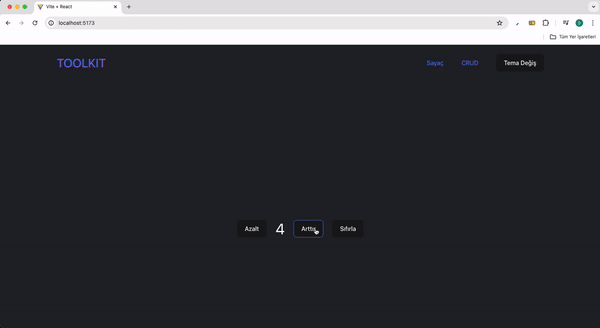

<h1>Redux Toolkit<h1>

<h2> Redux Toolkit kullanılarak hazırlanmış basit bir sayaç ve Crud sayfası.</h2>

<h3>Redux Toolkit<h3>

- Klasik redux'a göre dah az kod yazarak aynı sonucu elde edebiliyoruz.

- Dahili olarak thunk paketi içerisinde geliyor.

- Devtools eklentisi sayesind proje geliştiriken store'u reducer'ları, dispatch edilen aksiyonları an ve an izleyebiliyoruz

- Proje içersindeki state'i yönetmek bizim için daha kolay olucak

# Kurulum

- npm i @reduxjs/toolkit

- npm i react-redux

- store'u ve reducer'ları oluştur

# Slice

Redux toolkit im içerisnde yer alan tek bir noktada hem reducer hem de actionları tanımlamamızı sağlayan yapıdır.

Klasik redux'ta akasiyonları ayrı reducer'ları ayarı dosyalarda tanımlıyorduk.

Toolkit ile birlikte slice içerisinde ikisinide eksiye göre daha az kod yazarak tek noktada oluşturabilicez
# redux-toolkit
